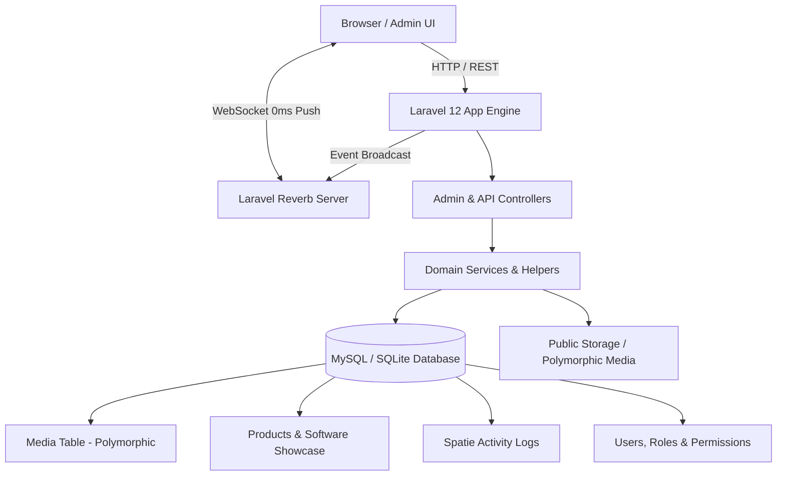

# Enterprise Admin & Microservice Dashboard Architecture


An enterprise-grade, high-performance **Laravel 12** Admin & Software Showcase Platform built with a dynamic **5-Theme Engine**, **Laravel Reverb WebSockets** for zero-latency push notifications, a **Polymorphic Media System**, **Spatie Activity Audit Logs**, and a responsive Blade component framework.

---

## 🏗️ System Architecture Flow



---

## ⚡ Tech Stack & Versions

| Requirement / Component | Technology | Version |
| :--- | :--- | :--- |
| **PHP Runtime** | PHP | `^8.3` |
| **Backend Framework** | Laravel Framework | `^12.0` (v12.x) |
| **WebSocket Engine** | Laravel Reverb | `^1.11` |
| **API Authentication** | Laravel Sanctum | `^4.0` |
| **Frontend Styling** | Vanilla CSS + Tailwind CSS | `v4.0` |
| **Interactivity** | Alpine.js | `^3.x` |
| **Asset Bundler** | Vite | `^6.x` / `^8.x` |
| **RBAC Authorization** | Spatie Laravel Permission | `^7.4` |
| **Audit Logging** | Spatie Activity Log | `^5.0` |
| **Broadcasting Client** | Laravel Echo + Pusher JS | `^2.0` / `^8.4` |

---

## 🚀 Key Features

### 1. Real-time Notifications via Laravel Reverb WebSockets
- Integrated **Laravel Reverb** WebSocket server (`php artisan reverb:start`).
- **0ms Instant Push Notifications**: `NotificationSent` broadcast event pushes notifications directly to `window.Echo` on private user channels (`App.Models.User.{id}`).
- **Interactive UI**: Includes mark-as-read, single notification delete, and bulk clear-all modal confirmation dialogs.

### 2. Developer-Configured 5-Theme Engine & Direction Support
- Configured via `.env` file for developer control:
  - `DEFAULT_THEME=emerald_slate` (`emerald_slate`, `royal_indigo`, `rose_midnight`, `amber_dark`, `cyan_teal`)
  - `APP_DIRECTION=ltr` (`ltr`, `rtl`)
- High-contrast card designs, vibrant badge accents, and glassmorphism styling across all viewports.

### 3. Reusable Polymorphic Media Architecture
- Centralized `media` database table paired with `App\Traits\HasMedia`.
- Models bind uploads seamlessly using collection names (`thumbnail`, `gallery`, `avatar`, `document`).
- Automatic fallback accessors (`thumbnail_url`, `gallery_urls`) for 100% backward compatibility.

### 4. Product & Software Showcase (4-Step Wizard)
- Comprehensive software management supporting **Web Apps**, **Android Apps**, **iOS Apps**, and **Custom Templates**.
- Step-by-step wizard for General Info, Live Preview Demos & Credentials, Media Uploads, Tech Stack Tags, and Module Add-on Estimator.

### 5. Activity Audit Log & RBAC Security
- Audit log tracking via `spatie/laravel-activitylog` listing administrative actions, user changes, and timestamps.
- Granular Role-Based Access Control via `spatie/laravel-permission`.

---

## ⚙️ Environment Configuration (`.env`)

Add or verify the following variables in your `.env` file:

```env
APP_NAME="Master Admin Panel"
APP_ENV=local
APP_KEY=
APP_DEBUG=true
APP_URL=http://localhost:8000

# Theme & Direction Controls
DEFAULT_THEME=emerald_slate
APP_DIRECTION=ltr

# Database Configuration
DB_CONNECTION=sqlite
# DB_HOST=127.0.0.1
# DB_PORT=3306
# DB_DATABASE=microservice
# DB_USERNAME=root
# DB_PASSWORD=

# Broadcasting & Reverb WebSockets
BROADCAST_CONNECTION=reverb

REVERB_APP_ID=891023
REVERB_APP_KEY=reverb_key
REVERB_APP_SECRET=reverb_secret
REVERB_HOST=127.0.0.1
REVERB_PORT=8080
REVERB_SCHEME=http

VITE_REVERB_APP_KEY="${REVERB_APP_KEY}"
VITE_REVERB_HOST="${REVERB_HOST}"
VITE_REVERB_PORT="${REVERB_PORT}"
VITE_REVERB_SCHEME="${REVERB_SCHEME}"
```

---

## 🛠️ Step-by-Step Installation & Setup

### 1. Clone & Install Dependencies
```bash
# Install PHP Composer Packages
composer install

# Install Frontend NPM Packages
npm install
```

### 2. Environment Setup & Key Generation
```bash
cp .env.example .env
php artisan key:generate
```

### 3. Database Migration & Storage Linking
```bash
# Run Database Migrations
php artisan migrate

# Link Public Storage Directory for Polymorphic Media
php artisan storage:link
```

### 4. Start Local Servers

In separate terminal instances, run the development servers:

```bash
# Terminal 1: Laravel Web Application Server
php artisan serve

# Terminal 2: Frontend Asset Watcher (Vite & Tailwind CSS v4)
npm run dev

# Terminal 3: Laravel Reverb WebSocket Server (Real-time Push Notifications)
php artisan reverb:start
```

---

## 📁 Core Directory Structure

```text
backend/
├── app/
│   ├── Events/
│   │   └── NotificationSent.php          # Reverb WebSocket Broadcast Event
│   ├── Http/
│   │   └── Controllers/
│   │       ├── Admin/                    # Admin Dashboard Controllers
│   │       │   ├── AccountSettingsController.php
│   │       │   ├── ActivityLogController.php
│   │       │   ├── NotificationController.php
│   │       │   ├── ProductController.php
│   │       │   ├── ProfileController.php
│   │       │   ├── RoleController.php
│   │       │   └── UserController.php
│   │       └── Api/                      # API Endpoints
│   ├── Models/
│   │   ├── Media.php
│   │   ├── Notification.php
│   │   ├── Product.php
│   │   └── User.php
│   ├── Modules/
│   │   └── Media/                        # Polymorphic Media Module
│   └── Traits/
│       ├── HasMedia.php                  # Polymorphic Media Trait
│       └── ApiResponse.php               # Standard JSON Response Formatter
├── database/
│   └── migrations/                       # Database Migrations
├── resources/
│   ├── css/
│   │   └── app.css                       # 5-Theme Engine & Tailwind CSS v4 Rules
│   ├── js/
│   │   ├── app.js
│   │   └── echo.js                       # Laravel Echo & Pusher JS Setup
│   └── views/
│       ├── admin/                        # Admin Views (Profile, Settings, Products)
│       ├── components/                   # Reusable Blade UI, Form & Mail Components
│       └── layouts/                      # App Layout Shells (Admin, Guest, Email, Error)
└── routes/
    ├── api.php
    └── web.php                           # Admin Web Routes & Middleware
```

---

## 📜 Maintenance Commands

```bash
# Clear Route Cache
php artisan route:clear

# Clear Compiled View Cache
php artisan view:clear

# Clear General Cache
php artisan cache:clear
```

---

## 📄 License

This application is open-sourced software licensed under the [MIT license](https://opensource.org/licenses/MIT).