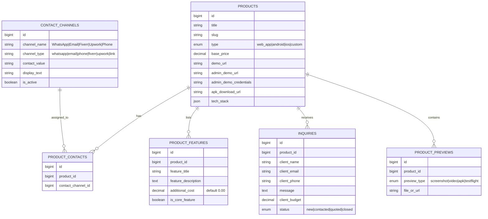

# Master Architecture Plan: Developer Showcase, Lead Generation & Custom Software Platform

A specialized software showcase and agency marketing platform designed for software developers and teams to showcase ready-made products, provide live previews, estimate custom project costs, and collect leads via dynamic contact channels (WhatsApp, Email, Fiverr, Upwork).

---

## 1. Core Modules Overview

```
 ┌─────────────────────────────────────────────────────────────────────────┐
 │                   VISITOR / CLIENT LANDING FRONTEND                     │
 └──────┬──────────────────────┬────────────────────┬──────────────────────┘
        │                      │                    │
 ┌──────▼─────────────┐ ┌──────▼────────────┐ ┌─────▼────────────────┐
 │  PRODUCT SHOWCASE  │ │ CUSTOM COST       │ │ DYNAMIC CONTACTS    │
 │  - Live Web Demo   │ │ ESTIMATOR         │ │ - WhatsApp Direct   │
 │  - Demo APK / iOS  │ │ - Feature Tiers   │ │ - Email / Phone     │
 │  - Admin Preview   │ │ - Estimated Price │ │ - Fiverr / Upwork   │
 │  - Video & Screens │ │ - Custom Quote    │ │ - Inquiry Form      │
 └────────────────────┘ └───────────────────┘ └─────────────────────┘
```

---

## 2. Dynamic Contact & Inquiry Management System

### A. Dynamic Contact Channels (Admin Configurable)
- Admins can add/edit multiple contact channels:
  - **Type**: `whatsapp`, `phone`, `email`, `fiverr`, `upwork`, `telegram`, `custom_link`.
  - **Label**: e.g., *"Chat on WhatsApp for Instant Demo"*, *"View Fiverr Profile"*, *"Technical Consultation"*.
  - **Value / URL**: `https://wa.me/8801700000000?text=I+want+to+buy+your+Laravel+App`.
  - **Is Primary / Product Assignment**: Assign specific contacts to specific products.

### B. Project Inquiry & Custom Quote Request Form
- Visitors can submit project inquiries:
  - Selected Product (Optional)
  - Name, Email, Phone/WhatsApp
  - Project Type (Pre-built App Customization, New Web App, New Mobile App)
  - Estimated Budget & Deadline
  - Requirements description
- Action: Saves inquiry to Admin Panel DB + triggers instant Email / WhatsApp notification to team.

---

## 3. Custom App Feature & Cost Estimator

Help visitors calculate estimated development costs based on features they select:

- **Features Tiers**:
  - *Core Features* (included in base price).
  - *Add-on Modules* (e.g. Push Notifications, Payment Gateways, Multi-language, Dark Mode, Admin Dashboard).
- **Interactive Calculator**:
  - Visitors select desired features $\rightarrow$ Live estimate summary $\rightarrow$ One-click "Send Inquiry via WhatsApp / Form".

---

## 4. Database Schema Overview



---

## 5. Phased Implementation Roadmap

### Phase 1: Core Showcase & Preview Engine
- Products CRUD (Title, Type, Tech Stack, Base Price, Demo URLs, Admin Credentials, Video Embeds, Screenshot Gallery).
- Public Showcase Frontend with live demo buttons and preview tabs.

### Phase 2: Dynamic Contact System & Lead Inquiries
- Admin Contact Channels management (WhatsApp, Phone, Email, Fiverr, Upwork).
- Public Contact Widget on product pages & Inquiry Submission Form.

### Phase 3: Cost Estimator & Feature Calculator
- Feature Tiers & Additional Modules setup per product.
- Interactive Estimator UI for visitors to calculate estimated costs and submit custom project requests.

### Phase 4: Future E-commerce Integration (When Ready)
- Shopping Cart, Stripe / SSLCommerz / bKash Payment Gateways, ZIP download links, and automated License Engine.
